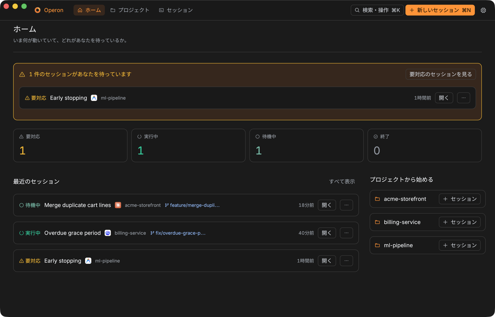
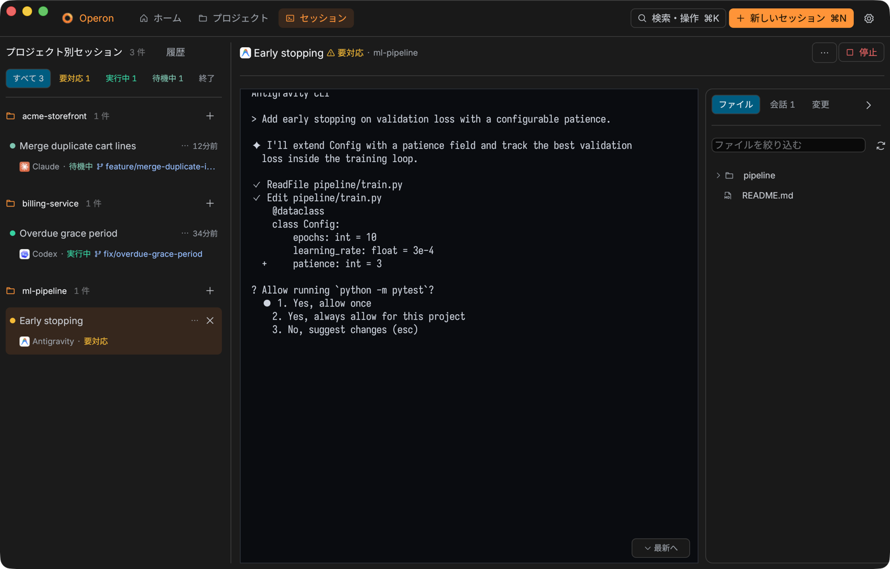
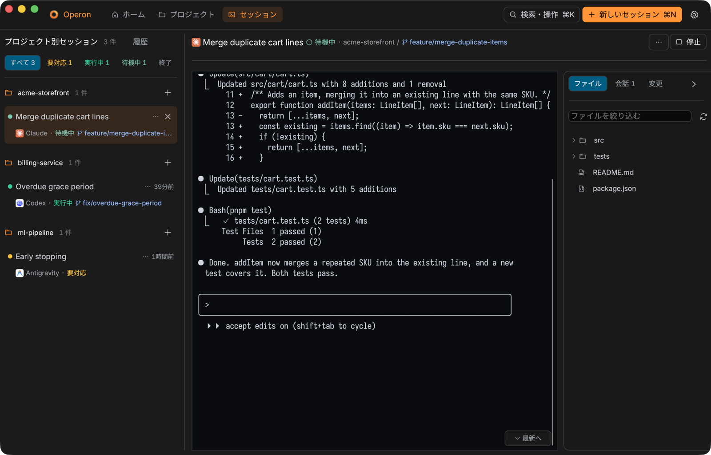
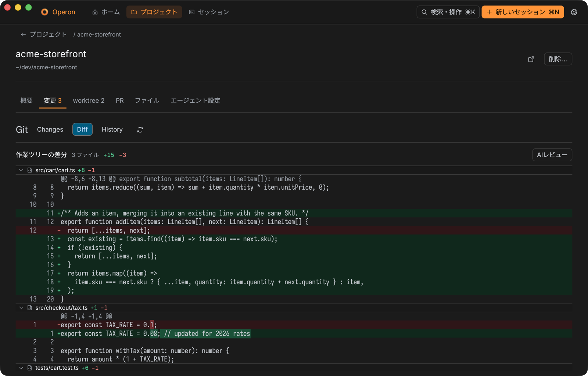
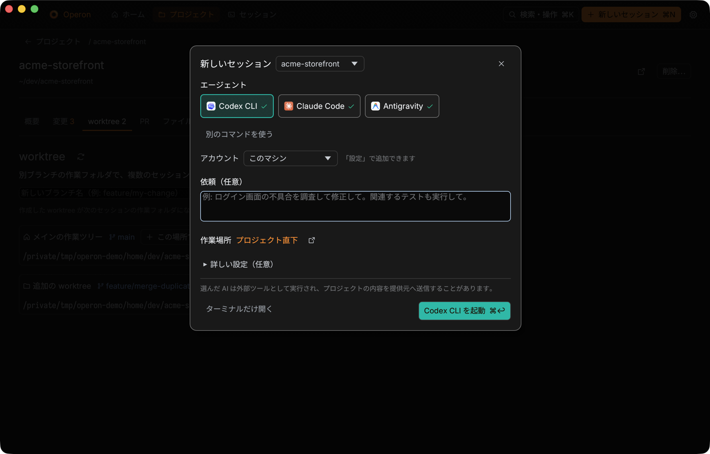
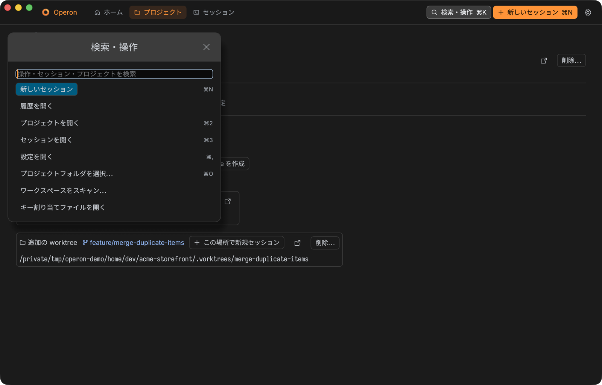

# Operon

**A local-first macOS cockpit for AI coding agents.**

[](LICENSE)
[](#requirements)
[](https://www.rust-lang.org/)

English · [한국어](README.ko.md) · [日本語](README.ja.md) · Manual: [EN](docs/MANUAL.md) · [KO](docs/MANUAL.ko.md) · [JA](docs/MANUAL.ja.md)

---

Operon is a native macOS desktop app, written in Rust, that gives you one
place to run and supervise AI coding agents — Codex CLI, Claude Code,
Antigravity CLI (`agy`), or any custom agent — across all of your projects.
Every agent runs inside its own detached `tmux` session, so the work outlives
the app, stays attachable from a real terminal, and remains fully under your
control.

Everything runs locally. Operon has no telemetry, no accounts, and no cloud
service. The interface speaks English, Japanese, and Korean.



## Screenshots

The screenshots below show the Japanese interface; switch the language in
Settings.

| | |
| --- | --- |
|  |  |
| **Needs you** — a waiting permission prompt is detected and surfaced first. | **Live session** — the real tmux terminal, beside the files, the conversation, and the changes. |
|  |  |
| **Diff review** — the working tree diff, with commit, push, and an AI review. | **New session** (`⌘N`) — pick an agent, write the request, choose where it works. |



**Search & actions** (`⌘K`) — every action, session, and project from one box.

## Features

### Agent sessions

- Home dashboard with project and session activity at a glance — one line per
  recent session, and a start button for each project — plus `⌘K` to
  find a session by any part of its title, request, agent, branch, or project —
  and a project by its name or path. Arrow keys move the selection, `Enter`
  opens it, and the actions it has always offered are still first.
- One "+" and one search, both in the toolbar: **新しいセッション** (`⌘N`)
  starts a session from any page, and **検索・操作** (`⌘K`) is the only search.
  The sidebar's **履歴** opens local transcript search and the session grid.
- Sessions that wait for you are pinned above the projects in the session
  list, longest wait first, each with how long it has waited and what its
  agent last said. `⌘J` opens the next one and puts the keyboard in its
  terminal, and the toolbar's **要対応 N** does the same while one waits.
  `⌘K` also finds a session by what its agent last said, and among equal
  matches a waiting session comes first. The side panel (files, conversation,
  changes) opens on the right of the terminal; `⌥⌘B` folds it and opens it.
- **新しいセッション** opens a sheet over the page you are on: the agent, the
  request, and where to work, with everything else folded under 詳しい設定.
  The launch button sits at its bottom right, and `⌘↩` presses it. A project's
  **概要** tab summarises it — sessions, uncommitted changes, worktrees — and
  finding and restoring past CLI conversations lives in **履歴**.
- The keyboard is a file. Every shortcut the window answers to — the palette,
  a new session, the three pages, settings, the folder picker,
  find-in-terminal, the next waiting session, the side panel — has an id and
  a chord in `keybindings.json`, in the same folder as the local index, and
  `⌘K` lists each action with the key it currently has. `キー割り当てファイルを開く`
  in that list writes the file from the current keys the first time and reveals
  it; it never overwrites one that is already there. A chord is `Mod+Shift+K`
  with `Mod` meaning ⌘, and `null` means no key at all. A file that gives one
  chord to two actions is refused whole and says which two — half a keymap is
  worse than none, because nothing tells you which half took.

- Add projects with the standard Finder folder picker (`⌘O`) or by dragging
  folders in from Finder; scan a workspace and import all of its Git
  repositories at once. A project is any local working directory — Git-only
  views simply stay available when it happens to be a checkout.
- Launch Codex, Claude Code, Antigravity CLI (`agy`), or a custom agent in an
  isolated tmux session, or start an empty tmux session for manual work.
- Configure each launch's model, permission/sandbox mode, and reasoning
  effort. The exact command line each CLI actually accepts is combined,
  shown before anything starts, and invalid combinations are refused up front
  instead of failing inside a freshly opened terminal.
- Queue sessions behind an earlier session when work must happen in order;
  cancel queued work or explicitly start it after a prerequisite failed.
- Retry a failed managed session after safely checking and cleaning up its
  old terminal — without ever deleting the record.

### Supervision

- Inspect and message a live agent session without leaving the app.
- A turn that finishes, or stops to ask, while you are reading another session
  leaves that session marked in the list until you open it, and the banner at
  the top of the home screen lists the sessions that want you, or says none do — the ones waiting
  for an answer, the ones stopped on a prerequisite that failed, and the ones
  you have not read, counted once each. It opens the session list already
  narrowed to exactly those. Mark a session unread again from its row menu to
  come back to it. Marks are for the session you are in and do not survive a
  restart.
- Narrow the session sidebar to what you can act on. Four toggles across its
  header — **要対応**, **実行中**, **待機中**, **終了** — each carry a live count,
  and turning one on leaves only those sessions, dropping the projects that have
  none. Several can be on at once, the list says how many it is hiding, and
  nothing is selected when the app starts, so a filter never survives a restart
  to hide a session without explaining itself.
- Where an agent CLI supports it, Operon registers a small status hook in that
  CLI's own settings file, so working, waiting, and finished come from the CLI
  itself rather than from reading its screen — within about a second, naming the
  tool it is running, and without a resume or a `/clear` being mistaken for a
  finished turn. Registration is one switch in Settings, it preserves every
  entry the file already held, and turning it off removes exactly what it added.
- Operon reads each managed terminal's own screen to tell a session that is
  still working from one that is blocked on a question, and shows that state
  beside every session, with a count of those waiting for an answer.
- Scroll back through thousands of lines of terminal output in-app and copy
  the whole buffer without its colour codes in one click; open the underlying
  tmux session or the project folder with one click.
- Rename any session in place by double-clicking its title; restored,
  resumed, and plain terminals carry a badge saying where they came from.
- Optionally receive a native macOS notification when an agent finishes a
  turn, stops on a prompt that needs an answer, or exits.
- Recover running tmux sessions if the local index is ever lost.
- Persist session metadata locally and search sessions across projects.

### Git, diffs, and files

- Inspect working-tree changes, commit history, repository files, skills, and
  instruction files per project; list open GitHub pull requests with review
  and CI-check summaries through `gh`.
- Every diff is drawn the way an editor draws one: split back into files that
  fold shut, numbered against both sides of the change, and coloured by what
  each line did. Where an agent rewrote a line in place, the words that
  actually changed are marked inside the row, so a one-argument edit in an
  eighty-column line is found by looking rather than by reading. Untracked
  files, renames, and repositories without a first commit are included.
- Create and select isolated Git worktrees for parallel sessions; remove only
  clean, inactive worktrees after an in-app confirmation. A new worktree starts
  from the project's mainline — what `origin/HEAD` names, else `origin/main`,
  `origin/master`, `main`, `master` — rather than from whatever the project
  folder happens to have checked out, and the confirmation says which one it
  used. Asking for a name that is taken gives you the next number instead of a
  refusal, so running the same task a second time in parallel is the same
  keystrokes as running it once.
- A repository can say once how a fresh checkout of it is prepared, by
  checking in `.operon/setup.sh`. After a worktree is made, Operon shows you the
  first lines of that script and asks; saying yes runs it in a session of its
  own, which you can watch, scroll, and stop like any other. Tick the box and
  the same contents run without asking next time — edit one character and it
  asks again, because what you approved was the script and not its file name.
- Notes on a diff, handed back in one message. Click a changed line while you
  are reading and write what is wrong with it; the note sits under the line, and
  it is still there after you quit. One action turns every note in the project
  into a single message naming each file and line, and sends it to the agent
  running there — refusing while that agent is mid-turn, because that is how a
  prompt gets cut in half. A note whose line has changed since you wrote it says
  so rather than being moved to a line that might not be the right one.
- Finish the work without leaving the screen you read it on. Tick the files
  that belong in the change — an agent that touched something nobody asked for
  can be left out — write the message or have a local agent CLI draft it from
  the staged patch, and push. The draft lands in the field for you to edit; it
  never becomes a commit by itself. Push refuses when the remote has moved on,
  and there is no force push in Operon in any spelling: a test forbids the
  strings from appearing in the source at all.
- Three worktrees mean three dev servers on ports handed out in start order.
  Each session's header names what its own worktree is listening on — `:5173
  vite`, `:3001 node` — read from `lsof` and joined to the worktree by the
  owning process's working directory, so the deepest worktree containing that
  directory is the one credited. Click to open, right-click to copy the URL. A
  worktree serving nothing says nothing.
- `⌘F` searches a session's scrollback. Every occurrence is washed where it
  sits — columns counted in terminal cells, so the mark lands on the text even
  on a Japanese line — and Enter steps through them while the pane scrolls to
  keep up. Nothing you type while searching reaches the agent, and a query being
  composed in an IME does not search until it is committed.
- How much of the Claude window is spent, in the toolbar, without Operon making
  a request of its own. Claude Code hands its own status-line command a
  `rate_limits` object on every turn, piggybacked on a response it already made;
  Operon installs a reader in that slot — never over one you already use, and
  never back into one you have emptied — and the number arrives over the same
  local socket the status hooks use. Past 80% the number turns amber; older than
  half an hour it goes faint and says its age.
- Ticking files and committing rewrites the git index: it is emptied and then
  refilled with exactly what was ticked, so a file staged by hand and then
  unticked cannot ride along. Drafting a message does the same, before the CLI
  ever runs. One selection it will not touch is a hunk selection — if `git add -p`
  in a terminal pane left part of a file staged and part not, both actions refuse
  by name rather than flattening it, because that selection lives only in the
  index and nothing could bring it back.
- **Land a worktree**: One action merges a completed worktree branch back into the
  mainline locally (`git merge --no-ff`), matching how local repositories finish work.
  Strict guardrails refuse if either tree has uncommitted changes, if zero commits
  are ahead, or if an agent is still running. On success, an optional auto-cleanup
  removes the worktree and deletes the merged branch with `git branch -d`.
- **Run scripts (`.operon/run.sh`)**: If a repository defines a run script for dev
  servers or builds, Operon surfaces a one-click Run button with an approval dialog
  displaying preview and content digest. Approved scripts execute in an isolated tmux session.
- **GitHub PR creation & issue import**: Create pull requests via `gh` directly from the
  diff screen or session menu with optional AI summary drafting. In the new session sheet,
  import open GitHub issues to automatically pre-populate the request and branch name.
- **Checkpoints & rollback**: Capture lightweight snapshots (`refs/operon/checkpoints/`)
  automatically per turn or manually. Review diffs since any checkpoint or roll back
  instantly if an agent makes unwanted modifications.
- **External editor launch**: Open any worktree or project folder directly in VS Code,
  Cursor, Zed, or Finder from the worktree list or session menu.
- **Prompt templates**: Quickly insert reusable instructions into session prompts from
  built-in templates (code review, CI fix, merge conflict resolution, test generation)
  or repository-specific templates in `.operon/prompts/*.md`.
- The path in a stack trace is the way to the file. Hover it in the terminal
  and it underlines; click and the editor opens at that line. Addresses a dev
  server prints open in the browser the same way. Only paths that resolve to a
  file inside the session's own folder are offered, so nothing underlined is
  unfollowable and a trace naming somewhere else cannot become a way of reading
  it — including in a worktree session, where the file is opened against that
  worktree and the tab says which branch it came from, so two copies of the
  same path are never mistaken for one. While the pane has focus a plain click
  still just goes to the pane — hold
  ⌥ to open — because an agent being talked to should not lose the keyboard to
  whatever scrolled under the pointer.
- Built-in editor: a folding project tree with a Git badge beside every file
  an agent touched, tabs, line numbers, syntax highlighting for common source,
  script, markup, data, and configuration formats, and `⌘S` to save. Markdown
  renders as Markdown — the format agents write their plans and reviews in —
  with checklists drawn as checkboxes and fenced code coloured by the language
  it names, and each file offers a one-click diff against the last commit.
- Save over an agent's work, never: a file that changed on disk after it was
  opened refuses the save and says so, rather than silently winning the race.
- Notice an agent's work, always: the open file is compared against the disk
  every two seconds. With nothing typed, the agent's write simply becomes what
  you are reading and the app says it reloaded; with unsaved edits, a bar offers
  the reload and the diff rather than choosing for you.

### Cross-CLI conversation restore

- Resume a discovered or managed Codex, Claude Code, or Antigravity session in
  a managed tmux terminal using the provider's own resume identity, preserving
  the complete conversation history.
- Two subscriptions for the same CLI, without logging out of either. An account
  is the folder Codex or Claude Code keeps its login in; register it once, pick
  it beside the agent when starting a session, and that session runs as it. The
  managed hooks go into every registered folder as well as the machine's own, so
  a session under a second login still reports what it is doing, still marks a
  finished turn unread, and still shows its usage. Nothing inside the folder is
  ever read, and nothing about it leaves the machine.
- The permission mode, the reasoning effort, and the switches each CLI accepts
  are chosen on the launch screen, from that CLI's own list — Operon never
  writes a flag of its own. Two switches the CLI refuses together cannot both be
  on, and one it refuses beside a mode is not offered while a mode is set. A
  switch the CLI's own table names as running without asking is marked, and
  cannot be launched until the warning beside it has been agreed to in writing —
  including when it is typed by hand into a custom command, which is judged by
  reading the command rather than the picker. An argument no table names but
  whose own name marks it a permission escape asks too, so a flag a CLI ships
  tomorrow is gated today; a flag a table has judged keeps the table's answer,
  in both directions.
- A resume reopens the agent that was having the conversation, not a default
  one: the model, the mode, and the switches the terminal was launched with
  travel with it, minus the ones that contradict a resume. The verb's hover text
  names what is coming, and takes the danger mark when one of them is a choice
  that needed acknowledging the first time.
- Restore any conversation from Claude Code, Codex CLI, or Antigravity into
  any of the three — either of the other two, or the same CLI again, which
  forks it into a second conversation without disturbing the first.
- Restores extract turns by rule from the transcript files the CLIs already
  saved locally. No model runs, no tokens are spent, and nothing is
  summarized or paraphrased; the source bytes stay in a local verbatim
  archive, and a readable rendering is written alongside as
  `restored-conversation.md`.
- A restore is the one job long enough to wait on, so it holds a modal window
  naming the source conversation, the destination, and the elapsed time —
  sendable to the background at any point.
- Local history search covers recent Codex and Claude JSONL transcripts
  (including generated titles) and discovers project-scoped Claude sessions
  launched outside the app — all read locally, nothing uploaded.

### A UI that keeps its promises

- Three themes ship — ダーク (default), ライト, and ハイコントラスト（ダーク） —
  switched live from Settings, including terminals that are already open.
  Every colour comes from a semantic role, each theme mixes those roles for
  its own surfaces, and automated tests hold every ink/surface pair to the
  WCAG 2.1 AA ratio for its size. The terminal's sixteen ANSI colours follow
  the theme too. [`DESIGN.md`](DESIGN.md) is the source of truth.
- Repeated actions use one shared icon vocabulary drawn from
  [Phosphor Icons](https://phosphoricons.com) (MIT), bundled as a font so the
  whole app draws its marks at one stroke weight; tests verify every glyph
  exists in the font rather than quietly becoming a blank box.
- The in-app interface is available in Japanese, English, and Korean (detected on
  first launch, changeable in Settings); strings not yet translated fall back
  to Japanese.

### Safety rails

- Only one Operon process may use the local session index at a time; a
  second launch warns and exits instead of risking last-writer-wins data loss.
- The metadata store carries a schema version. Updates go through a temporary
  file, flush, atomic rename, and directory flush; unsupported newer stores
  are preserved untouched instead of overwritten, and legacy indexes are
  imported atomically on first launch as a rollback snapshot.
- Stopping a running session writes a durable cancellation record before tmux
  is touched, so an interrupted stop stays retryable and reconciles correctly
  after restart.
- Agent commands are resolved on `PATH`, never probed. A command that fails
  on its first line stays readable: panes are retained, so exit status — not
  disappearance — is what counts as failure, and a session removed from
  outside the app is recorded as 結果不明 rather than 失敗.
- Scans are bounded and honest about it: the editor tree caps itself (and
  skips `.git`, `node_modules`, `target`, `.next`), files beyond 128 KiB open
  read-only, diff capture shares a fixed budget with explicit truncation
  notices, and transcript search caps candidates, bytes, and lines. Use an
  external editor for a complete view of very large repositories.

## Requirements

| Requirement | Notes |
| --- | --- |
| macOS | Apple Silicon or Intel |
| Rust toolchain | Install via [rustup](https://rustup.rs/) if `cargo` is unavailable |
| tmux | Required to launch sessions |
| At least one agent CLI | `codex`, `claude`, or `agy` on `PATH`; custom agents welcome |
| gh (optional) | For the GitHub pull-request view |

When launched from Finder, the app also checks common Homebrew and local-bin
locations so those tools remain discoverable.

## Getting started

```sh
git clone https://github.com/buddypia/operon.git
cd operon
cargo run --release
```

The first-run screen shows whether tmux and your agent CLIs are ready and
links to setup help when something is missing. Quit any installed build before
running from source (and vice versa) — the single-instance lock protects your
session index.

### Package a macOS .app

```sh
bash scripts/package-macos.sh
```

The script builds the locked dependency set for your Mac's architecture,
stages and verifies the new bundle, then replaces `dist/<App>.app` using
macOS's atomic bundle swap; normal failures restore the previous bundle, and
the last known-good build is kept alongside for manual rollback. The bundle
is ad-hoc signed for local development — public distribution to other Macs
requires an Apple Developer ID certificate and notarization, and Gatekeeper
may require an explicit local approval meanwhile.

## Privacy

Operon itself uses no telemetry, account, or cloud service. Coding agents
run as separate tools and may send project content to their configured
provider; review each agent's permission and sandbox mode before launch. The
local shared-session archive contains original transcripts and may include
sensitive prompts, tool outputs, and code; Operon creates its directories `0700`
and each snapshot `0600`, so only the account that made them can read them.

## Contributing

Issues, pull requests, and translations are welcome — see
[CONTRIBUTING.md](CONTRIBUTING.md) ([한국어](CONTRIBUTING.ko.md),
[日本語](CONTRIBUTING.ja.md)) and the [Code of Conduct](CODE_OF_CONDUCT.md).
Report vulnerabilities privately as described in [SECURITY.md](SECURITY.md). Please keep documentation changes in sync
across [README.md](README.md), [README.ko.md](README.ko.md), and
[README.ja.md](README.ja.md).

## License

Released under the [MIT License](LICENSE).

Third-party bundled assets retain their own licenses; see
[THIRD_PARTY_NOTICES.md](THIRD_PARTY_NOTICES.md). The agent icons in
`assets/agent-icons/` are trademarks of their owners and are **not** covered by
the MIT License.
[Phosphor Icons](https://phosphoricons.com) (MIT,
[`assets/fonts/LICENSE-PHOSPHOR.txt`](assets/fonts/LICENSE-PHOSPHOR.txt)) and
[Sarasa Gothic](https://github.com/be5invis/Sarasa-Gothic) (SIL Open Font
License 1.1,
[`assets/fonts/LICENSE-SARASA.txt`](assets/fonts/LICENSE-SARASA.txt)).
